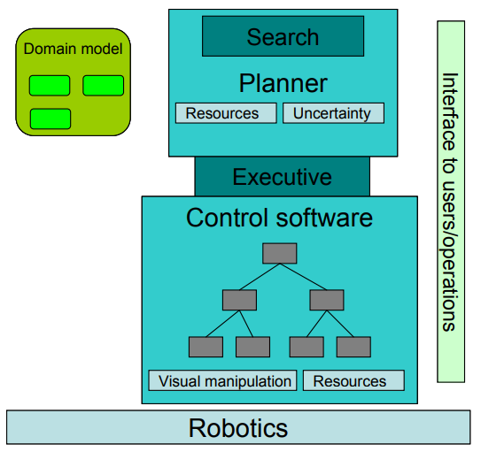
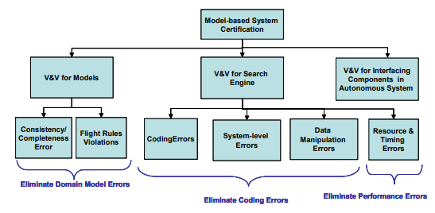
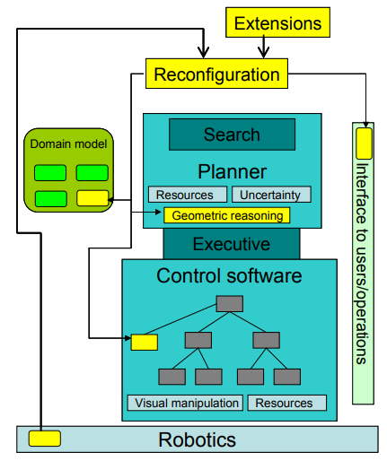
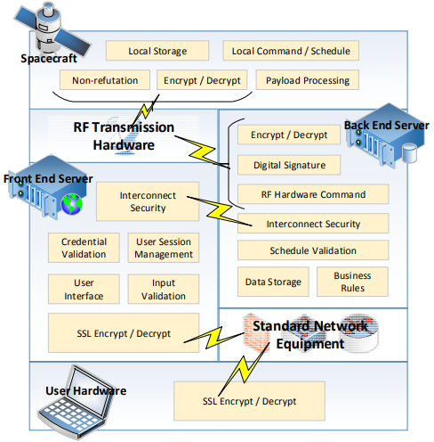

# Article 1: Intelligent Autonomy for Aerospace Engineering Systems
Aerospace engineering systems have undergone technological innovation improvements since first aircraft flights. This inexorable evolution of the aviation industry involves upgrades and updates on Communication, Navigation, and Surveillance (CNS) systems of aircraft as well as Guidance, Navigation, and Control (GNC) systems for air vehicles.

For both, CNS and GNC innovations, the aeronautical community is looking for more intelligent aerospace systems where autonomy plays a key role to keep air transportation safe and secure.

Unmanned Aerial Systems (UASs) are already part of the aviation community, e.g. an increasing number of autonomous UAVs (some of them are experimental but also serious approaches). However, the incorporation of intelligence to UAS decision-making processes to, for instance, either navigate in the case of UAVs, or control the air traffic is still at very early stages.

The analysis and design of IA for UASs require a strong interaction between computer science and engineering. Intelligent Autonomy (IA) solutions for UASs move away from classical engineering approaches to develop systems to now incorporate more specialized computation. However, systems engineering principles will be still applied to simplify the development and management processes of such systems.

Verification is one of the most challenging issue for IA no matter the domain unmanned systems are coming from. The problem is that a truly intelligent and autonomous system can have too many combinations of different output(s) for the same input(s). This makes very difficult the generation of all the possible combinations for the above inputs and outputs. Additionally, it can have the different outputs for the same set of inputs which makes IA behavior tough to predict. Thus, UAS are rather unpredictable, and even worse they become non-determinist; a definitely unwanted quality property for safety, in particular in aviation. A promising approach that researchers propose to use to verify IA is formal methods such as model checking. However, the application of this verification method reduces the solution space since it limits the above input-output relation (combination).

Validation of IAs is reasonably meaningless as verification gets complicated and cannot be done in full. It also suffers the same limitations verification has. This raises concerns about how reliable and robust IA systems can be which ultimately has an impact on the certification of IAs. The challenge set by the verification, validation, and certification of IA for UASs creates a good opportunity to develop innovative methodologies or tools.

# Article 2: Verification of Autonomous Systems for Space Applications
Autonomous software, especially if it is based on model, can play an important role in future space applications. For example, it can help streamline ground operations, or, assist in autonomous rendezvous and docking operations, or even, help recover from problems. Planners can be used to explore the space of recovery actions for a power subsystem and implement a solution without (or with minimal) human intervention. In general, the exploration capabilities of model-based systems give them great flexibility. Unfortunately, it also makes them unpredictable to our human eyes, both in terms of their execution and their verification. The traditional verification techniques are inadequate for these systems since they are mostly based on testing, which implies a very limited exploration of their behavioral space.

## Autonomous System Overview
The system under consideration follows a three-layered architecture.
1. The top layer, also called the decision layer, consists of a domain model and a search engine.
    - The domain model lists the constraints that describe the relationships between elements of the system (which may include environmental constraints) and the flight rules that need to be followed during planning.
    - The search engine does the actual planning, i.e., it elaborates and scheduled activities to meet a given goal under the constraints described in the domain model.

    The output of the decision layer is a plan.

2. The middle layer, also called the executive, takes a plan and “executes” it by issuing commands to the controllers in the bottom layer, also called functional layer. The executive is responsible for issuing commands, checking that commands are actually executed, and responding to exception signals generated by the controllers. 
3. The functional layer is a collection of controllers that actually command the hardware devices of the physical system. This is the lowest level of an autonomy software system.

In order to have a robust architecture, every component in the autonomous system built with the architecture must be verified.

The architecture also needs to support reconfiguration, not only in terms of adding, removing, or changing components in the functional layer, but also in terms of adding planning and execution capabilities. This guarantees us that the system can be deployed in a variety of domains and that it can evolve with technology progress. Taking into account reconfiguration actually helps the verification process.

## Verification Framework
From a Verification and validation (V&V) point of view, each element requires different techniques, even though some basic techniques (such as code analysis) can be applied across the board.

The functional layer, containing the control software, is the closest to traditional embedded software systems. It mostly consists of control device drivers for actuators or sensors as well as mathematical and algorithmic libraries. For these elements, we are mostly concerned with certifying that they cannot crash (regardless of their inputs) and assessing their performance in terms of execution time and memory management. This suggests that a V&V approach based on embedded system verification can be applied in a straightforward manner.

In some high-level view, the executive and the planner are quite similar. Using a formal model (the domain model for the planner and a plan for the executive), a reasoning engine computes an output (a plan for the planner and low-level commands for the executive). The reasoning engine is usually fairly mechanical (mostly performing searches) and rarely changed (in theory, only the domain model changes for a new application). Therefore, we can afford to bring to bear some “heavy” V&V techniques (e.g., precise static analysis, theorem proving) to verify that the mechanical operation of the reasoning engine (e.g., graph expansion, constraint propagations, and rollbacks) are properly performed.

For the domain model, the concern is well-formedness (are constraints legal?), consistency (can constraints lead to inconsistent solutions or a deadlock?), and completeness (have we specified all necessary constraints?).

As mentioned above, the engine requires checking for “mechanical” properties while models require some functional correctness verification. As shown in the picture, mechanical properties include programming errors (e.g., null pointer de-references), system-level errors (e.g., deadlocks and data races), and data manipulation errors (e.g., plan manipulation and constraint propagation). These properties are organized in a hierarchy that reflects the masking power of each fault class. For example, programming errors might mask synchronization errors, which in turn might mask data manipulation errors. This imposes a natural progression in the verification process: first, eliminate programming errors, then system-level errors, and finally, data manipulation errors. Once we have achieved a satisfying level of certification of “mechanical” properties, we can study performance of the engine (e.g., execution times and memory usage), which is important for on-board execution. Note that mechanical properties are checked only when the engine changes while functional properties are checked for each application (i.e., each new model).

## Reconfiguration
The figure below illustrates the possibilities for reconfiguration in our architecture. First, the most obvious place for reconfiguration is the functional layer where the control software sits. For example, adding a camera to a rover will trigger a reconfiguration in which control software for the camera needs to be added to the functional layer. Generally, such changes trigger changes in both the executive and the planner. The domain model needs to be updated with the constraints specific to the new camera. We can also imagine that new reasoning capabilities (e.g., geometric reasoning) can be added to the planner.

Reconfiguring autonomous systems is a complicated 
exercise. If the architecture is not adapted, it can trigger massive changes and result in high cost for the project. Therefore, the architecture needs to be designed for reconfiguration, which means that all aspects of the design need to take into account the possibility of reconfiguration. This is what we have done for verification; we have placed compositional verification at the heart of our verification process. Composition helps re-use verification artifacts in connection with new verification artifacts (for the added components) and efficiently put together the verification of the reconfigured system. In so doing we created a scalable verification mechanism which can deal with reconfiguration.

# Article 5: CyberSecurity for Aerospace Autonomous Systems
An autonomous system can, prospectively, be compromised by attacks against the AI (which seek to control it, overwhelm it or otherwise) as well as attacks against the supporting systems which the AI relies upon.

Cybersecurity is part of a larger area of consideration: system assurance. Assurance can be subdivided into two categories which can be effectively summed up as (1) making sure that required actions happen and (2) preventing prohibited actions from happening.

Required actions that must be assured to happen include supplying power at times to locations required of the requisite level and generating power of the amount required. Communications capabilities must be assured. Onboard computing, which is required for controlling the spacecraft, must also be guaranteed. Finally, the position determination and control system must be assured to work as must the attitude determination and control system.

Prohibited actions that must be prevented begin with the important goal of preventing overheating. The assurance process must also prevent any discharge of transmitted power to unintended targets or at incorrect times. The assurance process must also insure that power transmission does not occur within requisite safety margins. It must also prevent transmission when non-participating craft are in the way, when an attitude or position fix problem exists, or another problem is occurring.

The cybersecurity needs of a system are a subset of the assurance needs of the system. Cybersecurity is primarily concerned with three areas:
1. onboard software operations
2. ground station software operations
3. transmission link security.

In the first two categories, malware or other attack could prospectively cause the system to be activated at incorrect times, either via changing the definition of when appropriate operating times and locations are or be confusing the system in to believing that the time or its position, orientation and other characteristics are different than they are. An exploit in either of these areas could also result in the system being directly commanded into an override mode where assurance mechanisms to prevent against unintended operations are bypassed.

Transmission link security could cause similar issues. It may result in incorrect position, time or orientation knowledge and breaches could provide a vector for attacks against and the exploitation of vulnerabilities in either the ground or onboard software.

Also problematic is the fact that an exploit in any of these areas may place the spacecraft into an inconsistent state where further command is not possible but anyone, or where the owner/operator’s command capabilities are denied, but a third party attacker retains control. This last situation is perhaps the most problematic as it not only loses in the usability of the asset, but may result in some or all of the desired actions not occurring (e.g., supplying power to required locations) as well as any number of the undesired actions (e.g., sending power to an incorrect location) occurring. Finally, the spacecraft may be used to impair the operation of other spacecraft through physical collision, if third-party control is gained.

This system is comprised of multiple parts (in the parlance of space mission design, these parts are referred to as segments, which may be comprised of one or more components).
1. the ground segments (command/control stations and receiving stations) must be secured against unauthorized physical and electronic access, tampering and the loss of critical security credential information (credential information security may also involve third party credential issuers).
2. the communications pathways to and from the ground must be secured to prevent denial of service, misuse or the loss of critical information (including security credential information).
3. third-party systems on which the spacecraft (or ground / communications systems) relies on for information must be secured against providing incorrect information or being impersonated by a malicious party.
4. the spacecraft itself must be secured against actioning unauthorized commands and providing sensitive data (including security credential data or data that could allow credentials to be determined or reduce the credential impersonation search space) to unauthorized parties.

Standard techniques exist for virtually all of these areas. These include standards for data encryption/decryption, access control and credential management, intrusion detection and such.

While best practices should be utilized for securing all of the foregoing, this is insufficient for this kind of system whose properties include:
- System operations are mission (possibly human life / safety critical) 
- System maloperation can possibly cause human injury / death / damage to property 
- System cannot be directly accessed by human operators (i.e., without relying on cyber component) to correct catastrophic error 
- System relies on information that may be interpreted different ways in light of other information.

To meet the needs of this type of a system, a more robust security mechanism must be utilized that evaluates system operations holistically and makes both operations-level and systems-level decisions in light of a broader picture view. 
This is, of course, analogous to how a human would make decisions.

To this end, all critical commands will be subjected to a review by an onboard autonomous system, based on the concepts of expert systems This system will be tasked with evaluating the command, in context, to determine whether it should be actioned, or not. Commands and data that impact critical commands will also be vetted, either by this system or a command/data specific algorithm which will feed trust value information into this system.

It is important to note that, while this system can override virtually any command transmitted to the spacecraft, it cannot initiate key activities on its own. However, it can:
1. generate requests for information or instructions to human controllers
2. make decisions about onboard configuration (e.g., engaging the radio outside of believed transmission windows) to attempt to communicate with controllers or respond to urgent onboard problems.

While the second part of the system relates to spacecraft operating and not security software; the first part can be effected through the use of actions within the context of the Blackboard Architecture-based version of the system.