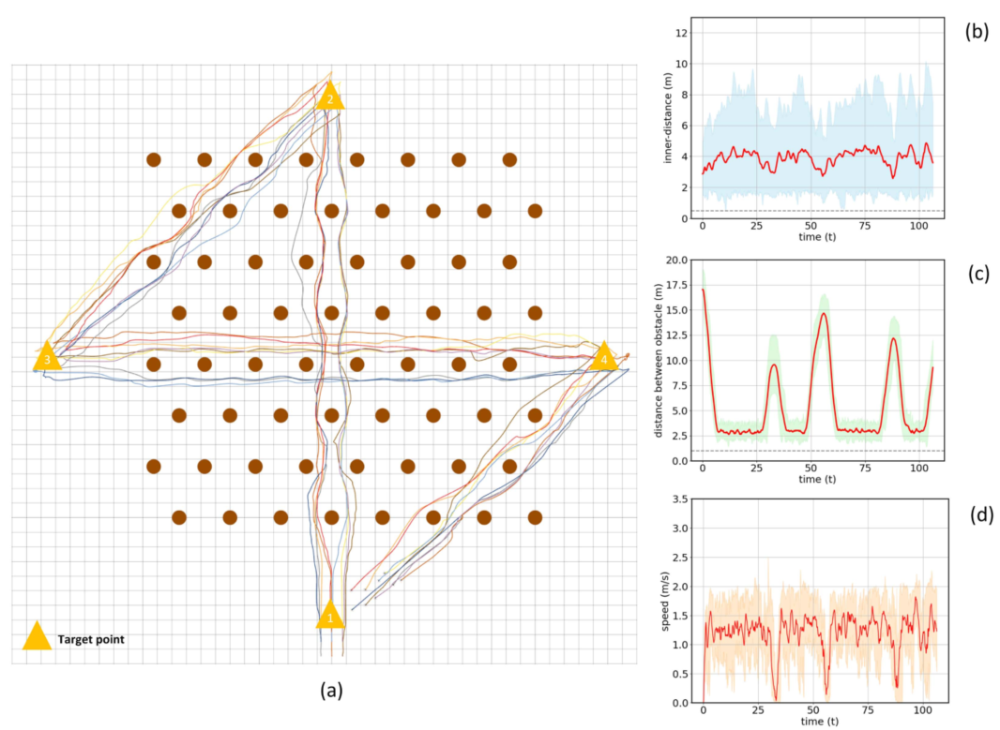
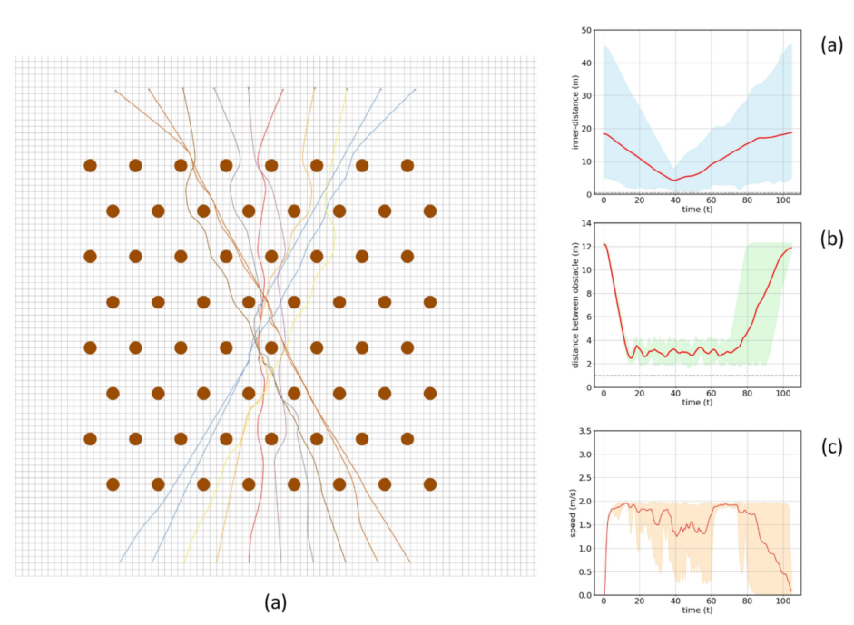

# A Survey of Trajectory Planning Techniques for Autonomous Systems (6)

**Path Planning** is the process of finding the optimal, or a close apporximation, route (or path) between two point in space. 
Whatever the environment is, be it fully/partially known or completly unknown, the algoritm must return a result to successfully instruct the robot to move in the correct direction.

A good path planning algoritm must meet 4 requirements:
- In a static context it must return the best path, or in the case of partially/unknown environment it should be able to give a good approximation on how to arrive at the goal. In general the best path is the better one for a specific self imposed policy or set of rules on how to act in certain situations.
- It must be adaptable to a dynamic environment
- It must follow the given policy and strategy
- It must be fast and light in terms of complexity, computability, data storage and energy consumption. The faster it is the quicker it can adapt to the changing environment and the more resource efficient it is, the longer it can operate without human assistance.

# Applications

## An Autonomous distribuited system of UAVs
This system uses a network of different unmaned areal vehicles (UAVs) to fly over complex environment like forests or restricted urban areas, to gather data. 
The main objective of the system is to simulate the behaviour of group flying done by certain species of birds in order to achieve a somewhat coherent and organized flying pattern for a more detailed and larger field of view and better obstacle avoidance.

This behaviour is based on a Nonlienar Model Predictive Control (NMPC) to define how the UAVs perceive the environment and what their behaviour should be.
The objectives of the models are two:
- **Short term objectives**: this includes mantaining an organized flying pattern and coordination between each device. Examples are maintaining certain distances or repositioning according to the group movement.
- **Long term objectives**: this includes trajectory and path planning to calculate the best and optimal route to arrive at the specified destination.

The suddivision is done to prioritize the short term goals like obstacle avoidance in order quickly react in case of sudden changes during the operation.

Each drone is programmed to communicate with their neighbours. This allows to reduce che computational complexity of each. Each drone checks for immediate collisions and so together they can generate a somewhat complete view of the environment. Whenever an obstacle is detected, they can organize with eachother to move together as a group without altering the original group formation too much.

### Simulations and results
Three situation where simulated to check the validity of the system.

1) **Forest Traversal**. The swarm must fly through a dense forest, modeled using cylindrical obstacles, and should arrive at 3 destination without breaking formation. In this case the drones were able to successfully navigate through the forest maintaining a safe group formation and a speed of approxially 1.5m/s

2) **Intense reciprocal collision avoidance**. Similar to simulation 1, but here the drones are not programmed to follow a specific group formation. Infact the UAVs are assigned to different targets and trajectories that will interserct with one another in a very confined space. This effectly simulates dense air traffic or chaotic situations.
The results of the experiment were that the NMPC is able to manage rapidally changing situation without putting the vehichle at risk, or other members of the group in the swarm.

### Conclusions

Given the results of the various experiments and simulation the NMPC system is capable of managing complex and delicate flying situation. The main topics for future research may be how to increase efficiency and durability to better adapt the UAVs to a real environment contaning more obstacles and harsh conditions.

## A distribuited system of autonomous satellites for space survaillence

This system was developed with the goal of advancing the detection of space debrie and space trajectories for other satellites.

This is really helpfull with the incresing number of satellites orbiting the Earth. It helps to monitor the traffic and the presence of foreign objects entering the trajectory of the already dense satellite traffic. Not only this but it helps to keep track of space junk to keep all the devices safe from unwanted collisions.

The architecture uses a network of autonomous satellites equipped with optical trackers to monitor artificial and natural objects floating in orbit. These satellites communicate with each other to share the information of the debries to have a detailed tracking of the position of these objects.
This allows the system to dynamically calculate the trajectory of this objects and plan avoidance strategy in case of collision.

Some simulations were done to test how the system would operate in certain conditions.
One focused on the tracking and trajectory prediction of a given object and another similar one to check how the system reacts if a collision is detected.
In both cases the satellites are able to easly detect the object and calculate a good approximation of the trajectory of the foreign object and react accordingly 

# Future Prospects

Even tho a lot of application nowadays rely on system that are capable of working without the assistance of human labor, we are still a long way to achive a truly autonomous system, expecially for space exploration and research.

There are many aspects that are still being developed to reduce the amount human interventions and increase the autonomy and atonomicity of these system. 

## Means of communications
Naturally high frequency radio waves like with 5G technology are the most common with these systems. But on a larger scale, this means of communinications start to suffer large propagation delays or even complete outage. Even with more reliable solutions like laser or optical communications, there's still the chance that the satellite or the agent must act even when communication with other agents is down.

## Self Preservation
Often the agents will suffer from all kind of damages be it, hardware software and generally degregation from long time use. A critical step forward would be self-healing and self-protecting strategies to enable the robot to continue its functionality without stopping and/or rely on human maintanance.
Some examples would be memory repairs when the storage is damaged or altered by radiation. Or maybe preserving the energy sources by reconfigurating it self to shut down unnecessary instruments or functions.
Similarly, the agents should be able to protect itself from external factors to preserve its functionalities longer. For example if a solar flare is detected, it may put it self to sleep mode to avoid electrical damages.
Or another example is move away from areas that are dangerous or contains somethings that can harm the agent in any way.

## Optimization 
As always, these kind of agent need to be able to use their resources efficiently. Be it computational power, storage capabilities, energy consumption, everything must be used to it's maximum without leaving anything behind.
Not only this, but they should be able to reconfigure them self to better adapt to their current needs in respect to the environment in which they are operating.
An example could be a system to automatically recalibrate its sensors and instruments to better match the changes in the environment, or (in case of swarms) to reposition themselfs to cover better spots or substitute members that dropped out.

Combining all of this aspects could lead to a true breakthrogh in the aerospace field and the development of fully autonomous systems that can operate without human intervention for an undetermined amount of time.

## Proof of Concept
A proof of this concept was made by NASA with their ANTS (Autonomous NanoTechnology Swarm). This would be a swarm of autonomous pico-classed drones with the mission of exploring the asteroid belt and map and research how these objects are composed.
These drones would be capable of reconfigure them selfs with the changing environment and to fix/repair themselfs trhough the use of AI and Machine learning to learn how to preserve the overall system. 